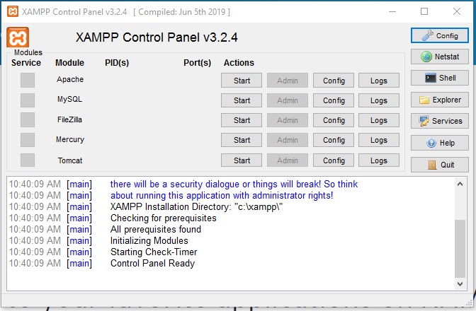

# Tugas 3 Database

### 1. Apa kepanjangan dari XAMPP?
- **X** = X melambangkan Cross-platform yaitu program ini dapat dijalankan dibanyak sistem operasi OS.
- **A** = Apacahe merupakan aplikasi web server. 
- **M** = MySQL merupakan RDBMS yang gratis dan mudah digunakan (user friendly). 
- **P** =  PHP, Bahasa pemrograman PHP merupakan bahasa pemrograman untuk membuat web bersifat server-side scripting.
- **P** =  Perl, bahasa pemrograman, pertama kali dikembangkan oleh Larry Wall di mesin Unix.

### 2. Bagaimana cara untuk mengakses XAMPP Panel?
Start -> All Programs -> XAMPP -> XAMPP Control Panel.

### 3. Module apa yang harus diaktifkan untuk menjalankan MYSQL Server?

### 4. Bagaimana cara menjalankan PHPMyAdmin di browser?

### 5. Bagaimana menjalankan MYSQL Client?
